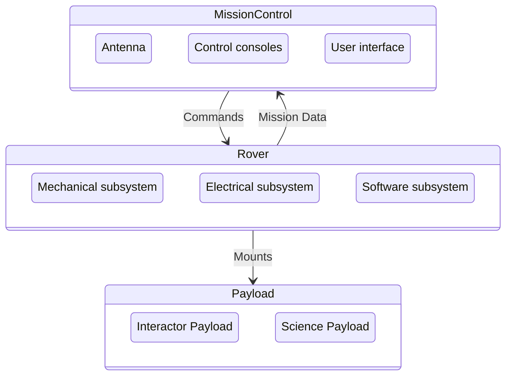

# MARS wiki
This repository is for those interested in [@MQRover](https://many.bio/MQRover). Clone this repository and open the vault using [Obsidian](https://obsidian.md/) for the best experience.

## Brief project overview
The goal of this project is to deliver a functioning robot and suporting systems / persons to Adeliade to compete in [ARCh](https://set.adelaide.edu.au/atcsr/australian-rover-challenge/). The competition will require the rover to complete a series of challenges.
At this very early stage these are some of the subsystems that have been identified.

## The Team
As a member of the project you are more important than the rover itself, with the right team rovers can be rebuilt, modified, or even be used as a platform for personal projects.
On the STEM side we will have
- Engineering
	- Mechatronic engineers 
	- Mechanical engineers 
	- Software engineers 
	- Electrical engineers 
- Science
	- The science task can change year on year, we need scientists.
- Management
	- Treasure / Secretary
	- Marketing / Media
		- Graphic design 
		- Social media marketing 
		- industry outreach
	- Human Resources
		- Events planning
		- Student onboarding
		- Sponsorship and industry outreach 
		- "Systems integration" This includes social systems

People are the heart of every society, getting them to work together is critical. Even if you know nothing about engineering or science we need you.