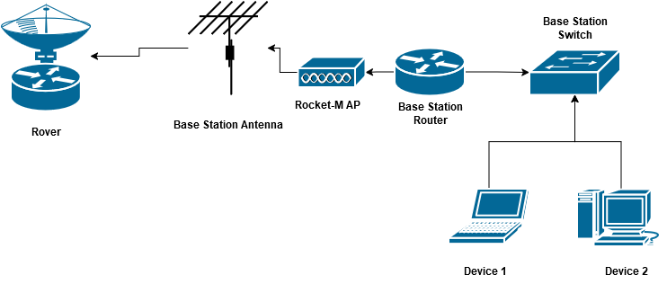

# Base Station Wireless Communication (WiFi)

## Option 1: Ubiquiti AM-Series
- 2G - 2.4Ghz Series
- 5G - 5Ghz Series

**2G Datasheet:**
https://dl.ui.com/AirMax2GSectors.pdf

**5G Datasheet:**
https://dl.ui.com/AirMax5GSectors.pdf

^ Both 2.4/5Ghz seem to be capable for the range (**double check this**)

Here is a comparison sheet for the whole series:
https://d347awuzx0kdse.cloudfront.net/netdigital/product-download/am-5g20-90_1.pdf?v=08009779f99676f195914412d1e25e782116a7f2

**NOTE**: None of these links have been sourced directly from Ubiquiti.

Parts can be sourced from:
- https://ubwh.com.au/
- https://www.bigw.com.au/search?text=Ubiquiti+AM-

Google Search Keywords: ["90 degree access point antenna"](https://www.google.com/search?q=90+degree+access+point+antenna&rlz=1C1ONGR_enAU1125AU1125&oq=90+degree+acess+apoint&gs_lcrp=EgZjaHJvbWUqCQgCECEYChigATIGCAAQRRg5MgkIARAhGAoYoAEyCQgCECEYChigAdIBCDU1MTZqMGo3qAIAsAIA&sourceid=chrome&ie=UTF-8)

**DISCLAIMER**: This recommendation is not necessarily complete and does not take into account other options available from other brands. The link above entails the research process for these choices.

---
Still need to connect this to the Rocket M AP which we'll need to connect to our router + switch combo inside the base station
also: 
3.13.3. Teams are required to supply their own cable at least 20 m in length to reach from the base station to their antenna.
(20m at least, cat-6)

---
"The antenna to the rocket-M from there it goes to the router, from the router it connects to the switch and then every laptop or device inside the base station connects to the switch. The router is connected to the chosen antenna and wireless communication either 2.4/5Ghz via Rocket-M Access-Point. This communicates with the rover wirelessly which is within the Sandbox."

---
Here is the link to the **Rocket M Series** Access Point:
https://www.netwifiworks.com/Rocket-M.asp

## Option 2: Ubiquiti NanoStation Loco
Parent link - https://ubwh.com.au/NanoStation-Loco/

Reccomendation provided by UBWH Australia:
- [LocoM2](https://ubwh.com.au/Ubiquiti/NanoStation-Loco/LocoM2)
- [WHIP](https://ubwh.com.au/UBWH/Antennas-airMAX/ANT-WHIP-2G-02)
- rpsma connection to Jetson
- we need to switch it from airMax (proprietary to ubiquiti) to WiFi AP mode, guide [here](https://support.hostifi.com/en/articles/7913035-airmax-m-how-to-use-a-nanostation-as-an-outdoor-wifi-ap).

This is what he recommended instead of us going with the basestation ones
he said it specs as 45 degree but thats for km of range and we should get plenty for the 100m we want. This is pretty cheap as well and we don't need a rocket and antenna separate.
Ships from WA and would be here in a week.
- ~$20 via AusPost (road)
- ~$38 via AusPost (air)

> If we have any questions about this we should [contact UBWH Australia](https://ubwh.com.au/#:~:text=Secure%20Log%20Off-,HOW%20TO%20CONTACT%20US,-UBWH%20Australia%0A%2002) as they seem quite knowledgeable. 

---
## Cisco Topology layout

