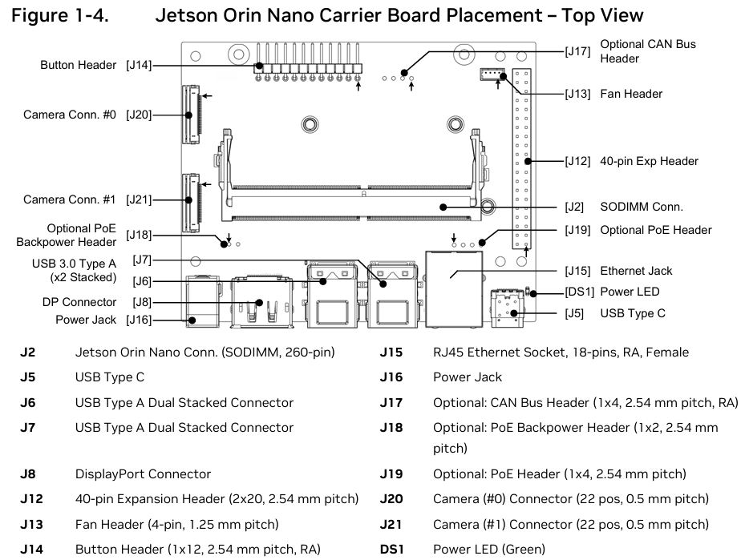
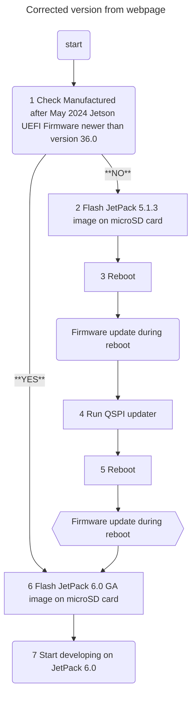

# Jetson Orin Nano Initial setup
Because we only ever set some thing up once this file documents the resources used and the final process followed.

## MARS Instructions

1. Check if Jetson UEFI Firmware version > 36.3
   - This can be done wither using monitor / keyboard or TTL
     - Monitor: To get to UEFI press ESC repeatedly while Jetson starts up, NVIDIA logo splash screen is the point that UEFI menu is reachable.
     - TTL: Implement the TTL interface, then press ESC on the console.
       - Connect as per [Setup](#ttl-setup).
       - PC: Run your console monitor program.
       - Nano: plug in the power.
   - If the version is correct jump to step 6.
2. Flash JetPack 5.1.3 image onto your microSD card.
   - Using [Balena Etcher](https://etcher.balena.io/#download-etcher) is recommended.
   - [Image details](https://developer.nvidia.com/embedded/jetpack-sdk-513)
   - 9GB download, ~5min burn.
3. Power-on and reboot to ensure firmware gets updated to 5.0 (JetPack 5.1.3).
4. Install and run QSPI Updater package.
5. Reboot and power-off the developer kit.
6. Flash JetPack 6.0 GA image onto your microSD card.
7. Power on to start developing on JetPack 6.

### TTL setup
Its possible to do an initial setup without a monitor, this requires a serial connection to the Jetson using its USART port on J14 (RXD (pin 3) and TXD (pin 4)) and GND (pin 7) for common digital reference.

- Adafruit USB <-> TTL
- Arduino board with a USB <-> TTL on the board
  - Attach ground to reset (prevents the main chip from starting)
  - **WARNING:** The silkscreen Tx and Rx will be inverted.

*Location of J14 is under the daughter board*

## Overall Flow
For more detailed expansion follow this [link to the online instuctions](https://www.jetson-ai-lab.com/initial_setup_jon.html).

