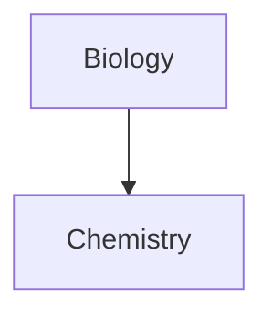

Most of Obsidians features are well documented on their wiki [Home - Obsidian Help](https://help.obsidian.md/Home)

# Diagrams
[Block Diagram Syntax | Mermaid](https://mermaid.js.org/syntax/block.html)
## Graph

