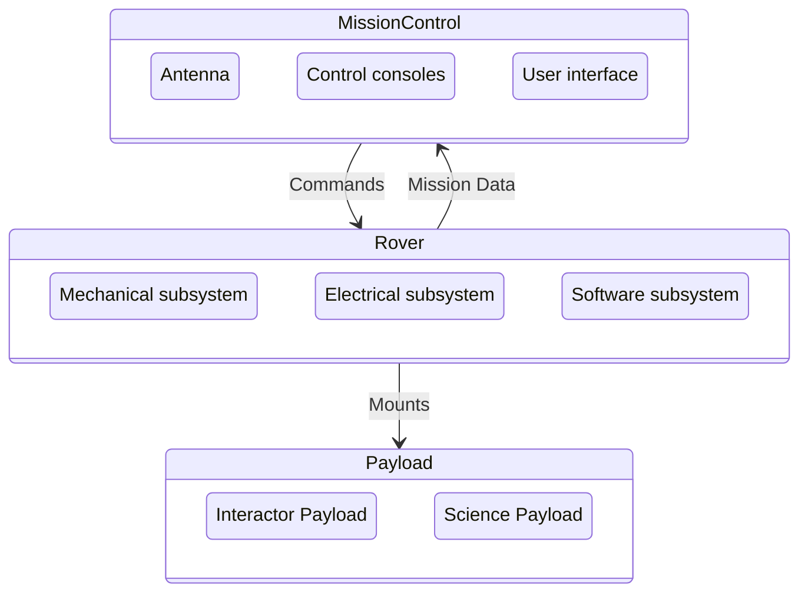

# Overview

```mermaid
stateDiagram 
	state MissionControl {
		Tele : Antenna
		Terminal : Control consoles
		GUI : User interface
	}
	
	state Rover{
		Mech : Mechanical subsystem
		Elec : Electrical subsystem
		Comp : Software subsystem
	}

	state Payload {
		Arm : Interactor Payload
		Science : Science Payload
	}
	MissionControl --> Rover : Commands
	Rover --> MissionControl : Mission Data
	Rover --> Payload : Mounts
class Arm, Science internal-link;
```
