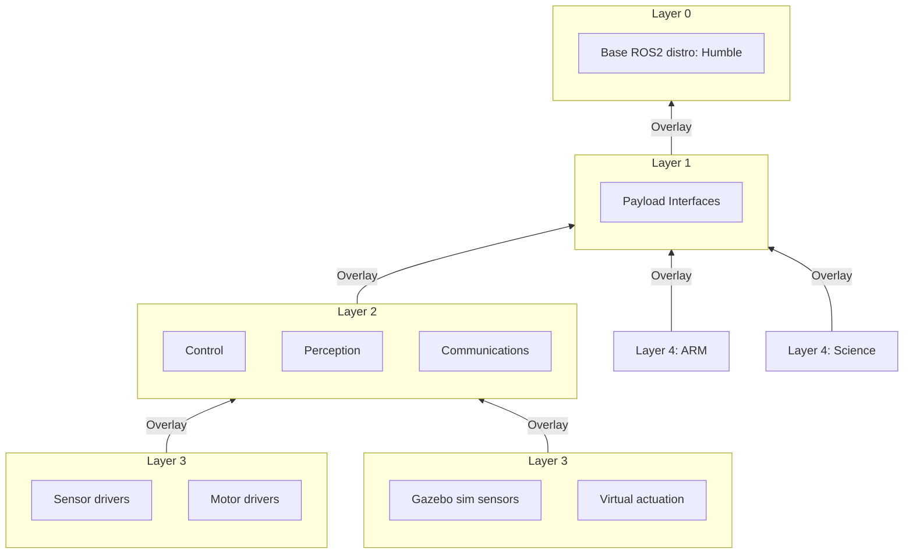

# Software directory
This directory is for system design / implementation information related to software components of the Rover.

## Robotic Operating System
ROS2 is used for the production Software System, ROS2 was chosen for its flexiblity, ease of intergration of new software components, distributed nature, relationship with Robotics, open-source nature,and large repository of ready made packages / tools.

ROS2 is installed in an environment by sourcing a workspaces `install/setup.bash` or equivalent for your system. Getting a workspace onto your system can be achieved by using package repositories, installing binaries, or compilation from sourcecode.

The ROS2 System is composed by layering workspaces (see below) to give a runtime environment that properly represents the robot in its current hardware configuration. The toplevel ROS2 layer is called the overlay, the layer underneath that is the underlay. While the underlay may itself be composed of additional underlays, from the perspective of the user all layers below the overlay appear as one layer called the underlay. The following layers allow for future modification and maintainence.
- Layer 0: The base ROS2 distribution chosen.
- Layer 1: Payload interfaces, this layer provides the shared interface definitions (topics, nodes, services) for payloads to be built from. This layer allows for payloads to be built without knowledge of other systems.
- Layer 2: Main robot functions, this layer processes sensor data, controls motors, and controls data flows.
- Layer 3: Environment interfaces, this layer is responsible for driving all real hardware (Sensors, Actuators, IMU, etc)
- Layer 4: Payload, this layer is added last. Special consideration should be taken to ensure that generated namespaces are nested within the `payload` namespace to eliminate potential conflict with Layer 3.

