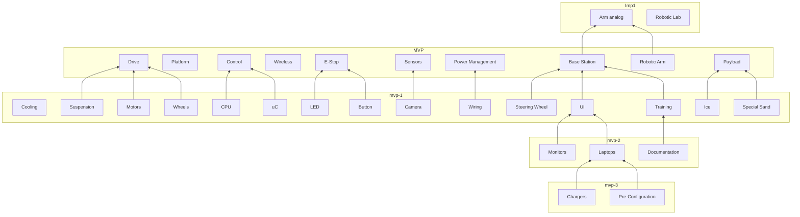

```mermaid
graph BT;
    %% subgraph Imp2

    %% end

    subgraph Imp1
        A1[Arm analog]
        A2[Robotic Lab]
    end

    subgraph MVP
        A[Drive]
        B[Platform]
        C[Control]
        D[Wireless]
        E[E-Stop]
        F[Sensors]
        G[Power Management]
        H[Base Station]
        I[Robotic Arm]
        J[Payload]
    end
    H --> A1
    I --> A1

    subgraph mvp-1
        COOL[Cooling]
        AA[Suspension]
        AB[Motors]
        AC[Wheels]
        CA[CPU]
        CB[uC]
        EA[LED]
        EB[Button]
        FA[Camera]
        GA[Wiring]
        HA[Steering Wheel]
        HB[UI]
        HC[Training]
        JA[Ice]
        JB[Special Sand]
    end
    AA --> A
    AB --> A
    AC --> A
    CA --> C
    CB --> C
    EA --> E
    EB --> E
    FA --> F
    GA --> G
    HA --> H
    HB --> H
    HC --> H
    JA --> J
    JB --> J
    
    subgraph mvp-2
        HBA[Monitors]
        HBB[Laptops]
        HCA[Documentation]
    end
    HBA --> HB
    HBB --> HB
    HCA --> HC

    subgraph mvp-3
        HBBA[Chargers]
        HBBB[Pre-Configuration]
    end
    HBBA --> HBB
    HBBB --> HBB


```

