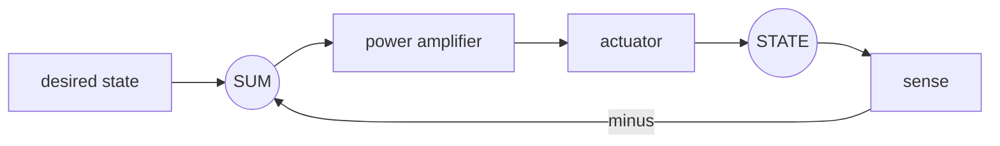

# 

```mermaid
flowchart LR
desired[desired state]
sum(( SUM ))
pwm[power amplifier]
act[actuator]
term(( STATE ))
sense

term --> sense
desired --> sum
sense -- minus --> sum

sum --> pwm
pwm --> act --> term

```