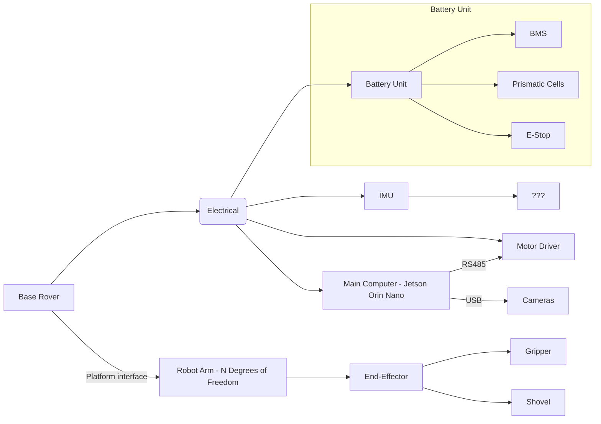
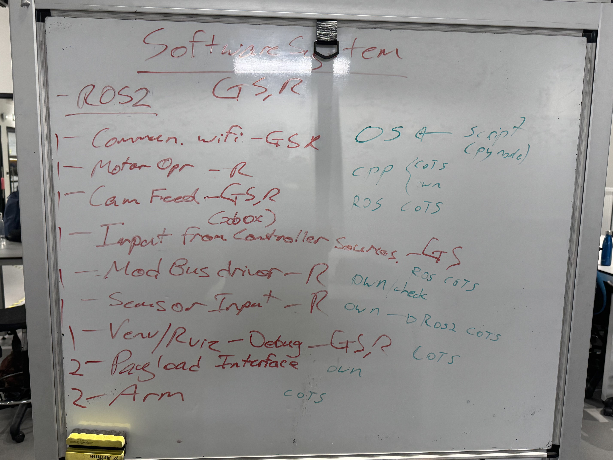
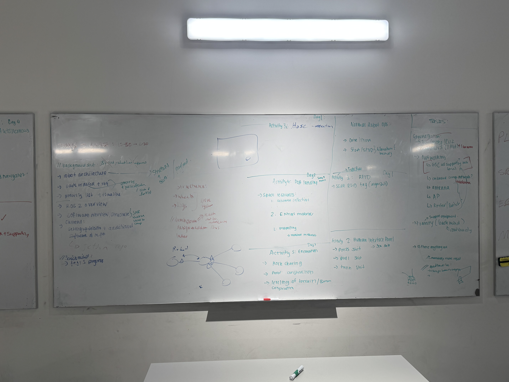
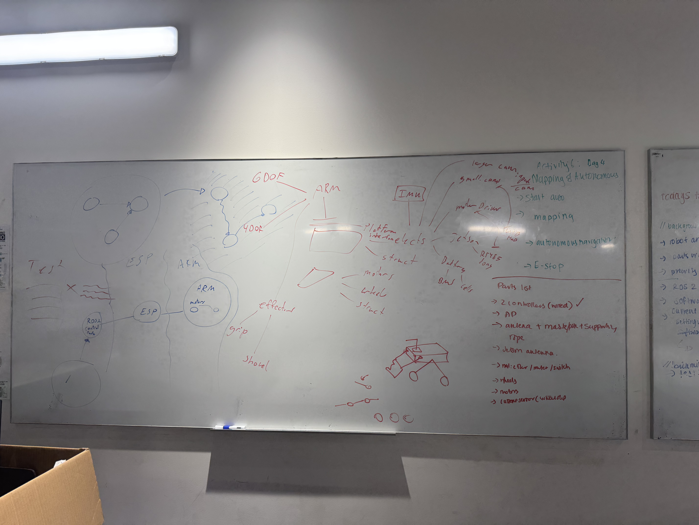

# Holiday Workshop #4 - Weekend Meeting

**Agenda**
- Robot architecture
- Parts ordered + requirements
- Priority list + timeline
- ROS2 overview
- Software overview/structure
- Setting up Jetson + additional software & repo

**Progress update on Structures**
- Legs & Wheels are required for drive system (URGENT)
- Solution: Build simple box with wheels for SAR. Refer [here](images/IMG_3963.jpeg).

**Parts list**
- 2 controllers (wired)
- AP
- Antenna + mask/pole + supporting rope
- Jetson antenna
- Ethnernet, router, switch
- Wheels
- Motors
- Current-sensor

**Software System**
The image below represents the breakdown of the software focus. All items earmarked with 1 are priority for field test, items marked with 2 would be highly sought for the field test to fully test our base systems.
> Issues have been created and assigned on the [project board](https://github.com/orgs/Macquarie-Aerospace-Rover-Society/projects/2/views/6?sliceBy%5Bvalue%5D=Software).

---
**Whiteboard Notes**

