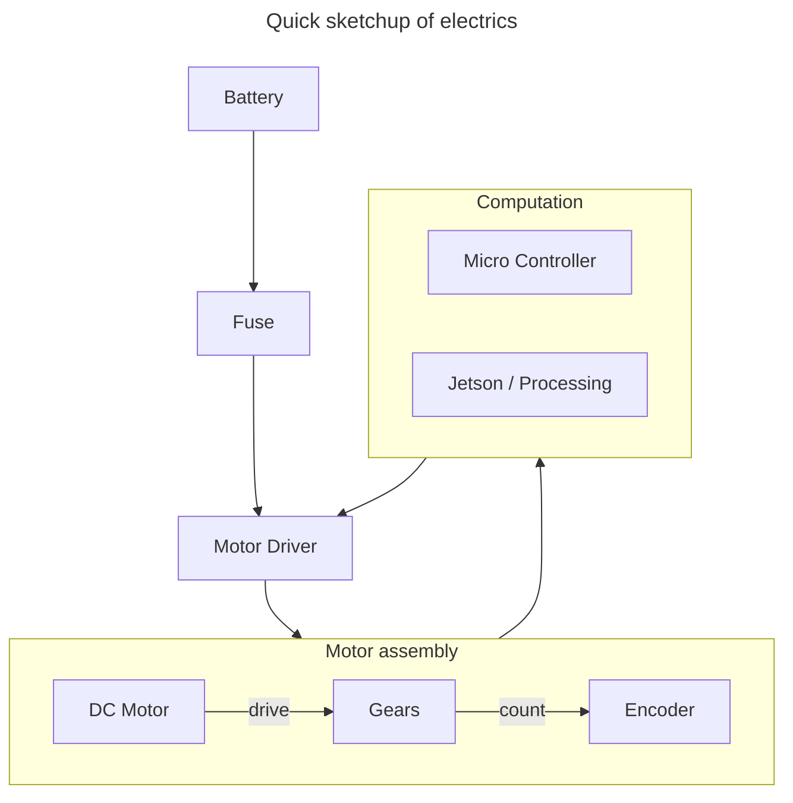

# MARS - Software team meeting 3

## Agenda

First meeting of this form

## Attendees
- Andrew
- 

## Minutes
- Introduced the project
  - Explained available files
  - Gave access to resources
  - Explained how things are going to work
- Jetsons
  - Is software ok to write drivers for motors
    - YES
  - BOM acquisition
  - Design alternatives
    - Orin Nano
    - Options
- Stability of the rover as a resource
  - Camera requires some of this resource
- Concerns about gearing
  - Power.
- Discussion of autonomous task
  - Presentation concerns
  - Jake: I ranked this as do nto attempt.
    - MoSCoW
- Going through the activities
- Structures and Electrical need to talk
  - 50kg motors
  - Upper and lower bounds
  - COTS
    - Jaycar
    - Vecs-Robotics
- Electrical system layout
  - Basic BOM done
  - 

## Basic electric BOM
Parts List
- Motors x4
- Encoders x4
- motor controler x(1-4)
- Battery
  - Backup battery for backup system
- Fuses
  - PDB
- "Brain"
  - Jetson / processor
- MicroControllers
- Wires >=2 Gauges
- "Anderson connectors"?

### Quick Diagram

## Software functions

## Action Items
- Electrical and Software talk about the motor Reqs
  - 