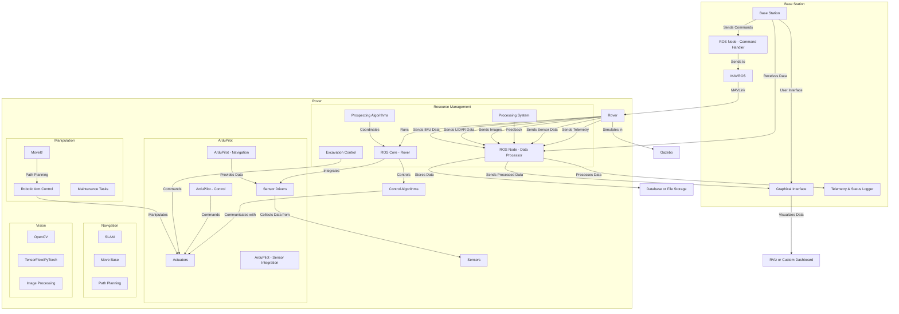

```mermaid
graph TD
    A[Base Station] -->|Sends Commands| B[ROS Node - Command Handler]
    A -->|Receives Data| C[ROS Node - Data Processor]
    A -->|User Interface| D[Graphical Interface]
    
    B -->|Sends to| E[MAVROS]
    C -->|Processes Data| F[Telemetry & Status Logger]
    C -->|Sends Processed Data| D
    
    E -->|MAVLink| F1[Rover]
    
    F1 -->|Sends Telemetry| C
    F1 -->|Sends Sensor Data| C
    
    F1 -->|Runs| G[ROS Core - Rover]
    
    G -->|Controls| H[Control Algorithms]
    G -->|Integrates| I[Sensor Drivers]
    
    H -->|Communicates with| J[Actuators]
    I -->|Collects Data from| K[Sensors]
    
    subgraph Rover
        F1
        G
        H
        I
        J
        K
        
        subgraph ArduPilot
            AP1[ArduPilot - Control]
            AP2[ArduPilot - Navigation]
            AP3[ArduPilot - Sensor Integration]
            AP1 -->|Commands| J
            AP2 -->|Provides Data| I
        end
        
        subgraph Navigation
            N1[SLAM]
            N2[Move Base]
            N3[Path Planning]
        end
        
        subgraph Vision
            V1[OpenCV]
            V2[TensorFlow/PyTorch]
            V3[Image Processing]
        end
        
        subgraph Resource Management
            RM1[Prospecting Algorithms]
            RM2[Excavation Control]
            RM3[Processing System]
            RM1 -->|Coordinates| G
            RM2 -->|Commands| J
            RM3 -->|Feedback| C
        end
        
        subgraph Manipulation
            M1[Robotic Arm Control]
            M2[MoveIt!]
            M3[Maintenance Tasks]
            M1 -->|Manipulates| J
            M2 -->|Path Planning| M1
        end
        
    end
    
    subgraph Base Station
        A
        B
        C
        D
        E
        F
    end
    
    F1 -->|Sends Images| C
    F1 -->|Sends LIDAR Data| C
    F1 -->|Sends IMU Data| C

    D -->|Visualizes Data| L[RViz or Custom Dashboard]
    C -->|Stores Data| M[Database or File Storage]
    
    F1 -->|Simulates in| N[Gazebo]
```
